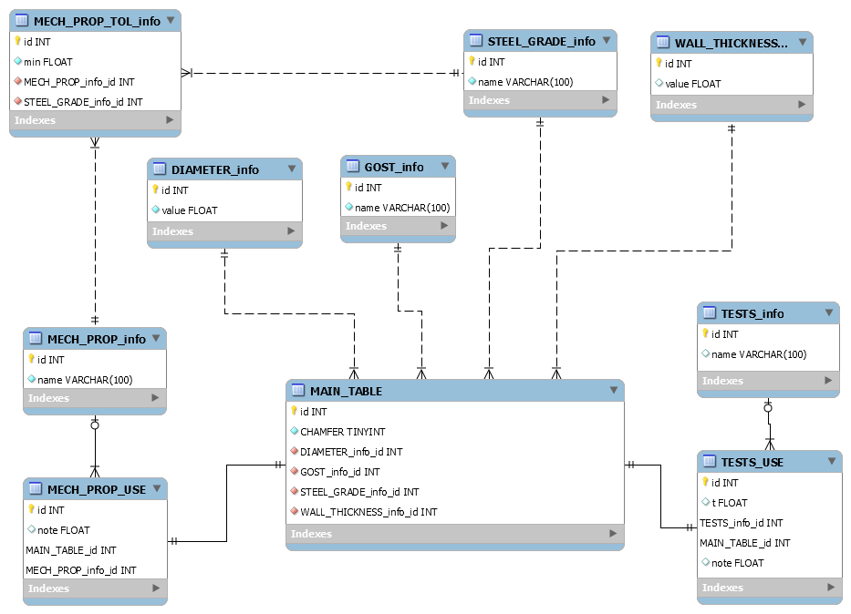

# MonitOrg (K2, Sochi 2023) + SORP (K5, Ekaterinburg 2024)

__*MonitOrg*__: веб-сервис для просмотра и редактирования базы продукции и производителей. Сервис сделан командой №2 в рамках кейса на хакатоне ИТ-трека Горизонтов в 2023 году, Сочи.

__*SORP*__: сервис для унификации требований к заказу. Сервис разработан командой №5 на хакатоне в рамках отборочных испытаний ИТ-трека Горизонтов 2024. 

## Зависимости

PostgreSQL, PHP, Apache. Рекомендуется к использованию пакет LAMP (XAMPP).

## Установка

### XAMPP
Установите последнюю версию XAMPP по ссылке: https://www.apachefriends.org/ в соответствие с вашей системой.

#### Добавление проекта на сервер
Существует два варианта разворачивания PHP проекта на сервере Apache с пакетом XAMPP: установив все файлы проекта в директорию __*htdocs*__, либо добавив его в настройки сервера как внешний ресурс.

Для того, чтобы добавить проект в __*htdocs*__, необходимо перейти в директорию __*XAMPP/htdocs*__ и скопировать туда все содержимое данного проекта.

Однако в рамках разработки использовался второй вариант: необходимо в директории __*XAMPP/etc*__ найти файл __*httpd.conf*__. Необходимо добавить следующие настройки:

**Добавление пользователя для запуска httpd (для пользователей Linux)**. Необходимо найти модуль **unixd_module** и добавить в него имя пользователя и его группу, от лица которого хотите запускать Apache сервер.

    <IfModule unixd_module>
    #
    # If you wish httpd to run as a different user or group, you must run
    # httpd as root initially and it will switch.  
    #
    # User/Group: The name (or #number) of the user/group to run httpd as.
    # It is usually good practice to create a dedicated user and group for
    # running httpd, as with most system services.
    #
        User ПОЛЬЗОВАТЕЛЬ
        Group ГРУППА ПОЛЬЗОВАТЕЛЯ
    </IfModule>

**Добавление директории проекта на сервер**. Необходимо найти первый модуль __Directory__ и добавить после него:

    <Directory "/путь/до/проекта/">
        Options Indexes FollowSymLinks ExecCGI Includes
        AllowOverride All
        Require all granted
    </Directory>

**Добавление элиаса для проекта**. Необходимо найти модуль __alias_module__ и сразу после него добавить строку:

    Alias / /путь/до/проекта/

Готово! Теперь при запуске Apache сервера данный проект будет корневым и роутинги, настроенные в проекте, будут корректно работать.
Можете запускать XAMPP удобным Вам способом: через GUI или CLI командой __*./xampp start*__.

#### Подключение модулей PostgreSQL
Найдите файл __*php.ini*__ в директории XAMPP (или в директории PHP, уже установленного в системе) и в модуле расширений активируйте модули PostgreSQL, добавив (раскомментировав уже имеющиеся) строчки:

    extension=pgsql
    extension=pdo_pgsql
    
Если XAMPP был запущен, перезапустите его. Теперь есть возможность взаимодействовать с СУБД PostgreSQL при помощи PHP.

#### Инициализация БД
Создайте базу данных PostgreSQL любым удобным для вас способом. Запишите данные для подключения к базе данных в файл __*config.json*__, находящийся в корне данного проекта. После создания БД, запустите SQL скрипты из файла __*psql_scripts.sql*__, находящегося в корне проекта. После исполнения скриптов в базе данных должны появиться сущности, часть из которых должна быть заполнена (словари с параметрами требований к заказам, например ГОСТ, диаметр, толщина стенок, испытание и пр.).

Схема базы данных (без сущностей продукции, производителей и пользователей):

После проделанных настроек, Вы сможете оценить работу сервиса, перейдя по адресу в браузере: http://127.0.0.1/
